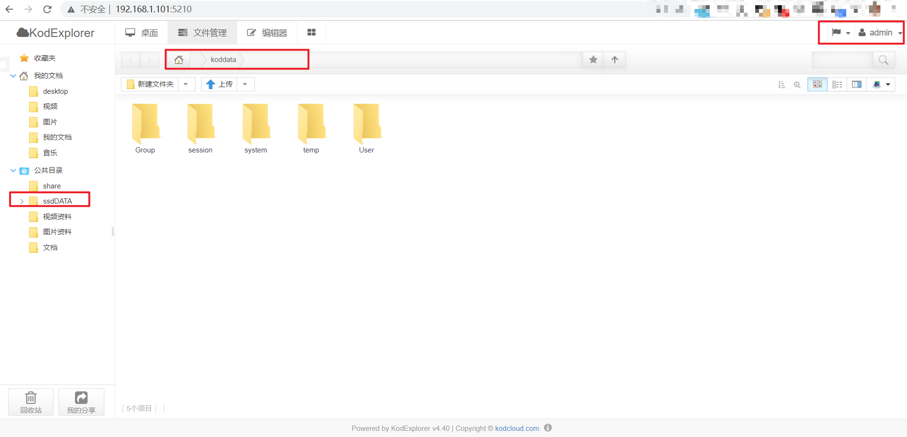
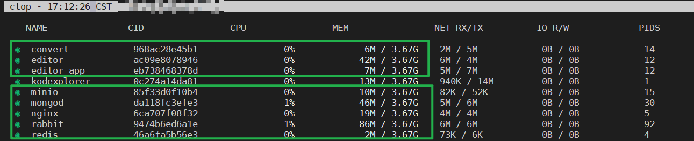

# kodexplorer for all platform

`已经使用github的buildx action实现构建支持多cpu的镜像`

1. 基于kodexplorer 4.40
2. 增加github上所有找得到的插件（街机模拟器除外）
3. 数据与/var/www/html文件夹分离，可挂载到/volume2并设置为工作目录

# 使用方法

```bash
docker run -d \
  --name kodexplorer \
  --hostname=kodexplorer \
  -p 5210:9000 \
  -v /your_path/koddata:/koddata \
  -v /var/media/ssdDATA:/koddata/Group/public/home/ssdDATA \
  --restart unless-stopped \
  dennischancs/kodexplorer
```

# 效果展示

1、admin：不再看到烦人的`/var/www/html`




2、demo：可以访问挂载的外置磁盘


3、【插件展示】毕升office离线服务（arm版）


4、kodexplorer+bisheng office共8个容器




# office离线编辑服务的部署

## onlyoffice插件的使用
ONLYOFFICE Document Server is an online office suite comprising viewers and editors for texts, spreadsheets and presentations, fully compatible with Office Open XML formats: .docx, .xlsx, .pptx and enabling collaborative editing in real time.

> kodexplorer_onlyoffice插件：[sit17/kodexplorer_onlyoffice: kodexplorer_onlyoffice](https://github.com/sit17/kodexplorer_onlyoffice)

> ONLYOFFICE/DocumentServer社区版【无arm64版】
* [ONLYOFFICE/DocumentServer](https://github.com/ONLYOFFICE/DocumentServer)
* [ONLYOFFICE/Docker-DocumentServer](https://github.com/ONLYOFFICE/Docker-DocumentServer)

```bash
# onlyoffice/documentserver为社区版镜像
sudo docker run -i -t -d -p 80:80 onlyoffice/documentserver
```

## 毕升office arm api版，实现arm64机器的离线编辑功能

详见：[api-deploy-arm: 毕升office 部署 arm版本](https://gitee.com/ibisheng/api-deploy-arm)

通过官方步骤可以安装成功，在s905x2机器上成功运行，几人使用，一点不卡，13MB的ppt打开时间在5秒左右。

**但是！！但是！！但是！！**

arm版毕升office的docker镜像**已知问题**如下：
【部署问题1】：`*.sh`和`*.yml`文件中的相对路径引用导致个别组件无法安装。
【解决方法】：arm版的docker-compose对相对路径不完善，需要修改`*.sh`和`*.yml`文件中的`cd`命令、`相对路径`、`变量引用`等，全部采用绝对路径即可。（参考见`api-deploy-arm`文件夹，改成自己机器的实际路径）

【部署问题2】nginx镜像为x86_64平台的，而且镜像太大，里面很多没必要的文件。
【解决方法】换镜像，改配置（见`api-deploy-arm`文件夹，nginx已经改好了。）

 【运行问题】编辑office文档，doc/docx、xls/xlsx支持较好，但编辑ppt/pptx文件偶尔会造成文件丢失（只剩下`22B`的空文件）。
 


总之：用作<u>*局域网预览*</u>还是不错的（整体内存占用也不高，还要什么自行车）。


# 附硬件：

小机器型号：a95x max，4G ram, 64ROM,  2T SATA(自己加的)

CPU型号：s905x2

操作系统：CoreELEC Amlogic-ng.arm

